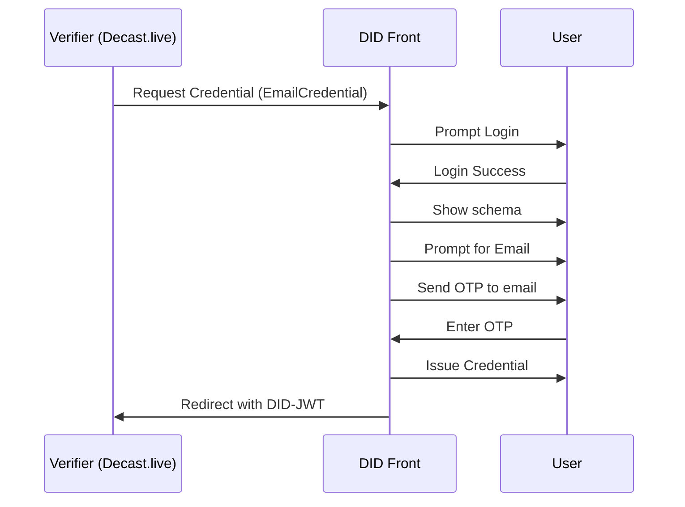

# Email Verification

## Schema Summary
This credential confirms that the user controls a specific email address by validating a one-time password (OTP).

**Credential Subject:**
- `email`: The user's email address.
- `verifiedAt`: Timestamp of verification.

## Schema JSON
```json
{
  "$schema": "https://json-schema.org/draft/2020-12/schema",
  "$metadata": {
    "uris": {
      "jsonLdContext": "ipfs://QmEmailSchemaExample"
    },
    "version": "0.01",
    "type": "EmailCredential"
  },
  "description": "Email OTP Verification Credential",
  "type": "object",
  "properties": {
    "credentialSubject": {
      "type": "object",
      "properties": {
        "email": { "type": "string", "format": "email" },
        "verifiedAt": { "type": "string", "format": "date-time" }
      },
      "required": ["email", "verifiedAt"]
    }
  }
}
```

## Verification Flow
1. Verifier requests email verification credential.
2. DID Front prompts user login.
3. User logs in and sees schema request.
4. If no credential exists, DID Front sends an OTP to user's email.
5. User enters OTP.
6. Credential is issued and signed.
7. DID-JWT is sent to verifier.

## Verification Flow (Mermaid Sequence Diagram)

