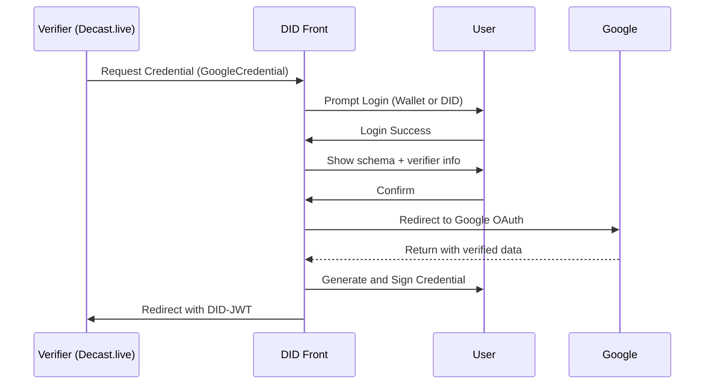

# Google Account Verification

## Schema Summary
This credential verifies ownership of a Google account.

**Credential Subject:**
- `email`: The verified email address.
- `name`: Full name as registered in Google.
- `verifiedAt`: The timestamp of verification.

## Schema JSON
```json
{
  "$schema": "https://json-schema.org/draft/2020-12/schema",
  "$metadata": {
    "uris": {
      "jsonLdContext": "ipfs://QmGoogleSchemaExample"
    },
    "version": "0.01",
    "type": "GoogleCredential"
  },
  "description": "Google Account Verification Credential",
  "type": "object",
  "properties": {
    "credentialSubject": {
      "type": "object",
      "properties": {
        "email": { "type": "string", "format": "email" },
        "name": { "type": "string" },
        "verifiedAt": { "type": "string", "format": "date-time" }
      },
      "required": ["email", "verifiedAt"]
    }
  }
}
```

## Verification Flow
1. Verifier (e.g., Decast.live) requests Google verification credential.
2. DID Front displays requested schema and verifier details.
3. User logs in using DID or wallet.
4. If credential is not yet issued, user is redirected to Google OAuth.
5. After OAuth approval, user returns and issues the credential.
6. A signed DID-JWT is sent to the verifier.

## Verification Flow (Mermaid Sequence Diagram)

