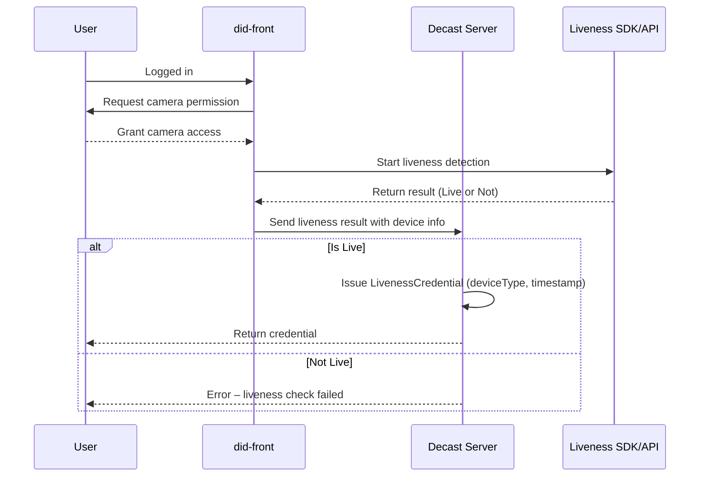

# 🟦 Liveness Check Verification

## ✅ Schema Summary

**Credential Type**: `LivenessCredential`  
**Description**: Proves that the user completed a liveness check successfully using a camera, confirming the subject is a real person (not a spoof or bot).

**credentialSubject fields:**

| Field         | Type   | Description                                |
|---------------|--------|--------------------------------------------|
| `id`          | string | DID of the credential holder               |
| `deviceType`  | string | The type of device used (e.g. mobile, desktop) |
| `timestamp`   | string | The time when liveness was verified        |

> Required fields: `id`, `deviceType`, `timestamp`

---

## 📄 Schema JSON

```json
{
  "$metadata": {
    "uris": {
      "jsonLdContext": "https://did.decast.live"
    },
    "version": "0.01",
    "type": "LivenessCredential"
  },
  "$schema": "https://json-schema.org/draft/2020-12/schema",
  "description": "Proof of Liveness Credential",
  "title": "Liveness Check Credential",
  "type": "object",
  "properties": {
    "credentialSubject": {
      "type": "object",
      "properties": {
        "id": {
          "type": "string",
          "format": "uri",
          "description": "DID of the subject"
        },
        "deviceType": {
          "type": "string",
          "description": "Type of device used for liveness check"
        },
        "timestamp": {
          "type": "string",
          "format": "date-time",
          "description": "Time when the liveness check was verified"
        }
      },
      "required": ["id", "deviceType", "timestamp"]
    },
    "@context": { "type": ["string", "array", "object"] },
    "expirationDate": { "type": "string", "format": "date-time" },
    "id": { "type": "string" },
    "issuanceDate": { "type": "string", "format": "date-time" },
    "issuer": {
      "type": ["string", "object"],
      "properties": {
        "id": { "type": "string", "format": "uri" }
      },
      "required": ["id"]
    },
    "type": {
      "type": ["string", "array"],
      "items": { "type": "string" }
    },
    "credentialSchema": {
      "type": "object",
      "properties": {
        "id": { "type": "string", "format": "uri" },
        "type": { "type": "string" }
      },
      "required": ["id", "type"]
    },
    "credentialStatus": {
      "type": "object",
      "properties": {
        "id": { "type": "string", "format": "uri" },
        "type": { "type": "string" }
      },
      "required": ["id", "type"]
    }
  },
  "required": [
    "credentialSubject",
    "@context",
    "id",
    "issuanceDate",
    "issuer",
    "type",
    "credentialSchema"
  ]
}
```

---

## 🔁 Verification Flow

1. After login, **User** is prompted to allow camera access.  
2. **User** grants permission and performs a real-time liveness test.  
3. **Decast** uses a liveness detection service (on-device or server-side) to validate that the subject is a live human.  
4. If valid, **Decast** issues a `LivenessCredential` with device type and timestamp as subject fields.

---

## 🔁 Mermaid Sequence Diagram

