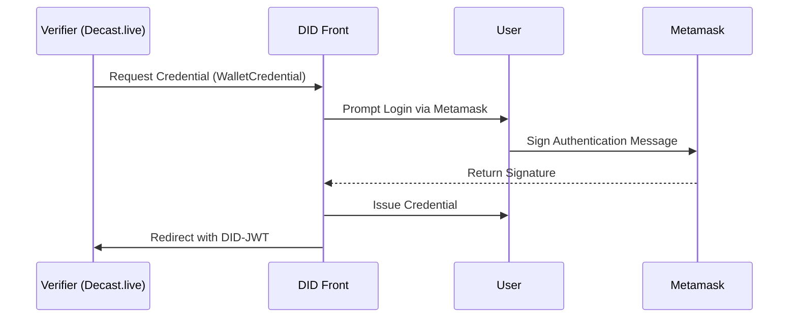

# Metamask Wallet Verification

## Schema Summary
This credential verifies the ownership of an Ethereum wallet using Metamask.

**Credential Subject:**
- `walletAddress`: Ethereum address.
- `verifiedAt`: Timestamp of signing.

## Schema JSON
```json
{
  "$schema": "https://json-schema.org/draft/2020-12/schema",
  "$metadata": {
    "uris": {
      "jsonLdContext": "ipfs://QmMetamaskSchemaExample"
    },
    "version": "0.01",
    "type": "WalletCredential"
  },
  "description": "Ethereum Wallet Verification via Metamask",
  "type": "object",
  "properties": {
    "credentialSubject": {
      "type": "object",
      "properties": {
        "walletAddress": { "type": "string" },
        "verifiedAt": { "type": "string", "format": "date-time" }
      },
      "required": ["walletAddress", "verifiedAt"]
    }
  }
}
```

## Verification Flow
1. Verifier requests wallet credential.
2. DID Front asks user to log in via Metamask.
3. User signs a message with Metamask.
4. Credential is created and signed.
5. DID-JWT is returned to verifier.

## Verification Flow (Mermaid Sequence Diagram)

