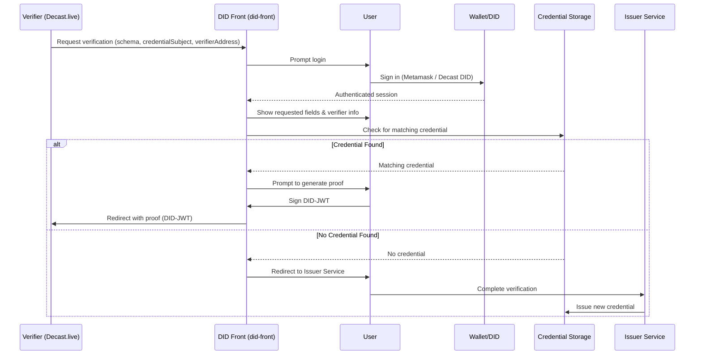

# Decast - Decentralized Identity Management System

A comprehensive monorepo for decentralized identity management, featuring a web application, Chrome extension, and DID resolver. Decast uses a decentralized identity (DID) system to enable secure, user-controlled identity verification across multiple services.

## 🏗️ Monorepo Structure

```
decast/
├── packages/
│   ├── did-web/           # Nuxt.js web application
│   ├── did-manager/       # Chrome extension
│   └── decast-did-resolver/ # DID resolver package
├── docker-compose.yml     # Docker orchestration
├── Dockerfile            # Root Docker build
└── pnpm-workspace.yaml   # pnpm workspace configuration
```

## 🚀 Quick Start

### Prerequisites

- **Node.js**: >= 22.0.0
- **pnpm**: >= 8.0.0
- **Docker**: >= 20.0.0 (optional)

### Installation

1. **Install pnpm globally**:
   ```bash
   npm install -g pnpm@8.15.0
   ```

2. **Install dependencies**:
   ```bash
   pnpm install
   ```

3. **Set up environment variables**:
   ```bash
   # Create .env file in packages/did-web/
   cp packages/did-web/.env.example packages/did-web/.env
   ```

4. **Start development**:
   ```bash
   pnpm dev
   ```

## 📦 Packages

##  🔁 DID Verification Flow
```mermaid
sequenceDiagram
    participant Verifier (Decast)
    participant User
    participant did-front
    participant DID Manager
    participant Service (e.g., Google, Email, Liveness)
    
    Verifier->>User: Click verification button
    User->>did-front: Redirect to verification frontend
    did-front->>User: Show requested data and login options
    User->>DID Manager: Login via Decast or Metamask (did:decast or did:ethr)
    DID Manager->>did-front: Return DID + check for existing claim
    alt Credential exists
        did-front->>User: Show VC ready
    else Credential missing
        did-front->>Service: Perform verification
        Service->>did-front: Save claim to DID Document
    end
    did-front->>Verifier: Redirect with DID-JWT
    Verifier->>Verifier: Validate DID-JWT & extract credential subject
    Verifier->>User: Grant access

```

## 📦 Monorepo Packages
decast-did-resolver
`did:decast` is a custom DID method that uniquely represents a user within the Decast ecosystem. It complies with the [W3C DID specification](https://www.w3.org/TR/did-core/) and provides:

- Cryptographic key association (Ed25519 by default)
- Public verification methods
- Authentication support (JWT, DIDComm, etc.)
- Optional service endpoints (profile, storages, etc.)

A custom DID resolver for the did:decast method. It enables DID Document resolution from our registry.

### 📄 View full documentation »

### did-manager

The did-manager is a browser extension for Chrome that allows users to manage their decentralized identities using the custom DID method did:decast:publicKey. It serves as a secure wallet for Decast identities, enabling key management and secure DID-based authentication.

#### 🔐 Features

* Generate new identities based on Ed25519 key pairs.

* Restore identity using a private key (manual input or paste).

* Remove identities from local storage.

* Export private key securely for user backup.

*  Multiple identity support: switch between multiple DID profiles.

### 🧾 Signing Workflow

The extension also acts as a signer for authentication flows:

1. A verifier (e.g., Decast or did-front) sends a signing request to the extension, including a nonce and request metadata.

2. The extension shows a UI prompt asking the user to review and confirm the nonce.

3. If the user approves, the message is signed using the selected private key.

4. The extension returns the signature, nonce, and associated did:decast back to the requesting origin.

This flow is used to:

* Log the user into Decast

* Authorize verifiable credential issuance

* Provide proof of key ownership

### 📄 View full documentation »

### did-web
Nuxt.js web application for DID management and verification.

**Features**:
- DID service management
- Identity verification
- Condition-based verification
- Proof generation

**Commands**:
```bash
pnpm --filter did-web dev      # Start development server
pnpm --filter did-web build    # Build for production
pnpm --filter did-web preview  # Preview production build
```

## 🔧 Monorepo Commands

### Root Level Commands

```bash
pnpm dev                    # Start did-web development server
pnpm build                  # Build all packages
pnpm build:web             # Build only did-web
pnpm build:manager         # Build only did-manager
pnpm build:resolver        # Build only did-resolver
pnpm clean                 # Clean all build artifacts
pnpm install:all           # Install dependencies for all packages
```

### Package-Specific Commands

```bash
# Run commands in specific packages
pnpm --filter did-web <command>
pnpm --filter did-manager <command>
pnpm --filter @decast/decast-did-resolver <command>

# Examples
pnpm --filter did-web dev
pnpm --filter did-manager build
pnpm --filter @decast/decast-did-resolver test
```

## 🐳 Docker Setup

### Production Deployment

1. **Build and run all services**:
   ```bash
   docker-compose up -d
   ```

2. **Build specific service**:
   ```bash
   docker-compose up -d did-web
   ```

3. **View logs**:
   ```bash
   docker-compose logs -f did-web
   ```

### Development with Docker

1. **Start development environment**:
   ```bash
   docker-compose --profile dev up -d
   ```

2. **Build extension and resolver**:
   ```bash
   docker-compose --profile build up -d
   ```

### Individual Package Builds

```bash
# Build did-web
docker build -f packages/did-web/Dockerfile -t decast-did-web .

# Build did-manager
docker build -f packages/did-manager/Dockerfile -t decast-did-manager .

# Build did-resolver
docker build -f packages/decast-did-resolver/Dockerfile -t decast-did-resolver .
```

## 🌍 Environment Variables

### did-web Environment Variables

Create a `.env` file in `packages/did-web/`:

```bash
# Google OAuth Configuration
GOOGLE_CLIENT_ID=your_google_client_id

# DID Service Configuration
DID_BASE_URL=http://localhost:3000

# Chrome Extension Configuration
EXTENSION_ID=your_extension_id
```

### Docker Environment Variables

Set environment variables for Docker containers:

```bash
export GOOGLE_CLIENT_ID="your_google_client_id"
export DID_BASE_URL="http://localhost:3000"
export EXTENSION_ID="your_extension_id"

docker-compose up -d
```

## 📊 Ports

- **did-web**: 3000 (HTTP)
- **did-manager**: 8080 (Extension builder)
- **did-resolver**: 3001 (Package service)

## 🔒 Security

- All containers run as non-root users
- Environment variables for sensitive configuration
- Health checks for production services
- Secure volume mounts

## 🧪 Development Workflow

1. **Local Development**:
   ```bash
   pnpm dev
   ```

2. **Package Development**:
   ```bash
   pnpm --filter <package-name> dev
   ```

3. **Testing**:
   ```bash
   pnpm test
   ```

4. **Building**:
   ```bash
   pnpm build
   ```

## 🚀 Deployment

### Production Deployment

1. **Build production images**:
   ```bash
   docker-compose build
   ```

2. **Deploy with environment variables**:
   ```bash
   docker-compose up -d
   ```

3. **Monitor services**:
   ```bash
   docker-compose ps
   docker-compose logs -f
   ```

### Staging Deployment

1. **Use development profile**:
   ```bash
   docker-compose --profile dev up -d
   ```

2. **Build extension**:
   ```bash
   docker-compose --profile build up -d
   ```

## 📝 Contributing

1. **Install dependencies**:
   ```bash
   pnpm install
   ```

2. **Start development**:
   ```bash
   pnpm dev
   ```

3. **Make changes** in the appropriate package
4. **Test changes**:
   ```bash
   pnpm test
   ```

5. **Build and verify**:
   ```bash
   pnpm build
   ```

## 🐛 Troubleshooting

### Common Issues

1. **pnpm not found**:
   ```bash
   npm install -g pnpm@8.15.0
   ```

2. **Port conflicts**:
   - Check if ports 3000, 3001, 8080 are available
   - Modify docker-compose.yml if needed

3. **Build failures**:
   ```bash
   pnpm clean
   pnpm install
   pnpm build
   ```

4. **Docker build issues**:
   ```bash
   docker system prune -a
   docker-compose build --no-cache
   ```

### Logs and Debugging

```bash
# View all logs
docker-compose logs

# View specific service logs
docker-compose logs did-web

# Follow logs in real-time
docker-compose logs -f did-web

# Check service status
docker-compose ps
```

## 📦 Storage Services

Decast uses DID-linked storage to manage secure file and stream storage, allowing each user's content to be cryptographically tied to their identity.

Soon

---

### 🧩 DID Verification Services

Each service represents a specific type of identity claim that a user can verify and associate with their DID:

* [Apple Account Verification](https://github.com/Leren-Leren/decast-did/blob/dev/docs/apple-account-verification.md): Apple login mapped to a DID identity

* [Google Account Verification](https://github.com/Leren-Leren/decast-did/blob/dev/docs/google-account-verification.md): Facebook login mapped to a DID identity

* [Facebook Account Verification](https://github.com/Leren-Leren/decast-did/blob/dev/docs/facebook-account-verification.md): Facebook login mapped to a DID identity

* [Email Verification (via OTP)](https://github.com/Leren-Leren/decast-did/blob/dev/docs/email-verification.md): Email login backed by a DID document and JWT

* [Metamask Ownership Verification](https://github.com/Leren-Leren/decast-did/blob/dev/docs/metamask-verification.md): Sign-in using Ethereum or EVM-compatible wallets (via nonce & signature)

* [Liveness Check (via camera)](https://github.com/Leren-Leren/decast-did/blob/dev/docs/liveness-check-verification.md): Face movement + image capture to ensure the user is present and human

## 🔧 Future Work

* Add test suites for service integrations
* Support for additional DID methods


## 📁 Repo Structure

```
decast-did/
├── packages/
│   ├── did-resolver/       # NPM module to resolve `did:decast:*`
│   └── did-manager/        # Browser extension for managing DIDs
├── README.md               # This file
└── ...
```

---

## 📚 Related Docs

- [Decast Auth API](https://did.decast.live)
- [DID Manager Extension](./packages/did-manager/readme.md)
- [DID Resolver Module](./packages/decast-did-resolver//readme.md)

---

## 📄 License

MIT

# Decast DID Verifications

Decast DID Verification is a decentralized identity (DID) proof system designed for use within the [Decast.live](https://decast.live) platform. It enables verifiers (such as Decast.live) to request specific identity credentials from users in a secure, privacy-preserving, and decentralized way using verifiable credentials and DID-based JWT proofs.

---

## 📌 Overview

This module facilitates:
- Requesting verification from users via DID.
- Securely presenting only the required fields (`credentialSubject`) defined by the credential schema.
- Generating a verifiable proof (DID-JWT) and redirecting it to the verifier.

---

## ⚙️ General Usage

1. **Verifier (e.g., Decast.live)** initiates a verification request with:
   - A **credential schema** that defines the structure of the credential.
   - A list of requested **credentialSubject fields** (e.g., `firstName`, `age`, `verifiedDate`).
   - Its own **verifier address**.

2. **did-front** (Decast DID Frontend):
   - Receives the verification query.
   - Prompts the user to log in via:
     - Metamask (wallet-based DID)
     - Decast native DID
   - Displays the request details:
     - Requested credentialSubject fields
     - Verifier information (e.g., `Decast.live`)

3. After login:
   - The app checks if the authenticated DID has a valid credential that matches the requested schema and `credentialSubject` fields.
   - If a matching credential is found:
     - The user is prompted to **generate a verifiable proof** (DID-JWT).
     - The app redirects the user back to the **verifier** (e.g., Decast.live) with the signed proof.
   - If no matching credential exists:
     - The user is directed to **complete the verification process** with the appropriate **credential issuer service** for the schema.

---

## 🔁 Verification Flow




  {
  "sub": "did:decast:abc123",
  "iss": "did:decast:abc123",
  "aud": "https://decast.live",
  "exp": 1720000000,
  "nbf": 1719990000,
  "iat": 1719995000,
  "credentialSchema": "did:decast:schemas:LivenessCredential",
  "credentialSubject": {
    "firstName": "John",
    "age": 30,
    "verifiedDate": "2025-07-25"
  }
}

🧪 Development

This repository consists of:
	•	did-front: DID authentication and credential presentation UI.
	•	did-sdk: DID-JWT generation, credential resolution, and verification logic.
	•	verifier-demo: Sample verifier implementation for integration and testing.


    🛠️ API Endpoints

Base URL: https://did.decast.live/api/v1

🔐 1. Login

Initiate a login session using a wallet or DID.

Request
POST /auth/login
Content-Type: application/json

Body
{
  "method": "wallet" | "did",
  "identifier": "0x123...abc" | "did:decast:xyz"
}

📥 2. Get All Registered DIDs

Retrieve DIDs associated with a user or wallet.


🆕 3. Register a New DID

Create and register a new DID.


✏️ 4. Update DID Document

Update fields in an existing DID document.
🗑️ 5. Remove a DID

Delete a DID (soft delete or revoke access).


🎓 6. Get Verifiable Credential (VC)

Fetch a verifiable credential (VC) for a DID document and schema.

