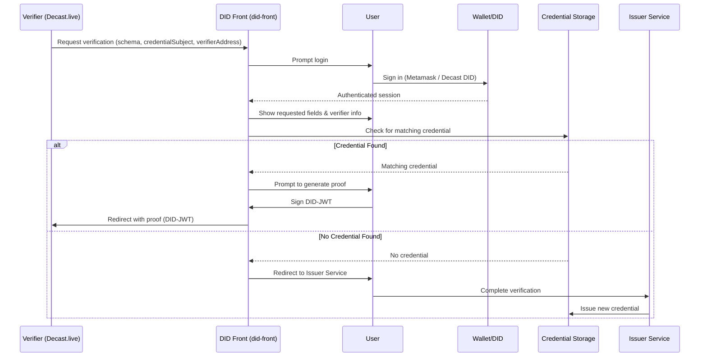

# Decast DID System

This repository provides the core infrastructure for handling Decentralized Identifiers (DIDs) in the [Decast](https://decast.live) platform.

Decast utilizes `did:decast` identifiers to enable secure, verifiable, and user-controlled digital identity in live communications, virtual events, and more.

---

## 🆔 What is `did:decast`?

`did:decast` is a custom DID method that uniquely represents a user within the Decast ecosystem. It complies with the [W3C DID specification](https://www.w3.org/TR/did-core/) and provides:

- Cryptographic key association (Ed25519 by default)
- Public verification methods
- Authentication support (JWT, DIDComm, etc.)
- Optional service endpoints (profile, storages, etc.)

---

## 🔐 Authentication via DID

Users on Decast can authenticate using a variety of DID-backed methods:

| Method        | Description |
|---------------|-------------|
| **Email**     | Email login backed by a DID document and JWT |
| **Google**    | Google login mapped to a DID identity |
| **Facebook**    | Facebook login mapped to a DID identity |
| **Apple**    | Apple login mapped to a DID identity |
| **Wallet**    | Sign-in using Ethereum or EVM-compatible wallets (via nonce & signature) |
| **ZKP**       | Future support for Zero-Knowledge Proof-based login (e.g. Sismo, Zupass) |

All sessions issue a signed DID-JWT that contains the user’s `did:decast` identifier.

---

## 🎥 In-Call Verifications

During a live Decast session (e.g., a stream, meeting, or broadcast), the following verification mechanisms can be applied:

| Verification      | Description |
|-------------------|-------------|
| **Liveness Check**| Face movement + image capture to ensure the user is present and human |
| **DID Assertion** | Prove identity ownership with DID and/or wallet signing |
| *(More coming)*   | Age-gating, reputation-based access, NFT-based roles |

---

## 🧩 Services Enabled via DID

| Service                        | How it uses DID |
|-------------------------------|------------------|
| **Identity Management**       | Self-custodied DID with recovery & linking options |
| **Cross-Platform Login**      | DID-based session token across Web, Mobile, and Extension |
| **Verifiable Credentials**    | Issue VCs tied to your `did:decast` (planned) |
| **Liveness-based Access**     | Join gated calls/events with verified presence |
| **Wallet + Role Integration** | NFT-based DID roles and permissions |
| **File & Stream Storage**     | Associate encrypted media & documents to a user's DID |

---

## 📦 Storage Services

Decast uses DID-linked storage to manage secure file and stream storage, allowing each user's content to be cryptographically tied to their identity.

Soon

---

## 📁 Repo Structure

```
decast-did/
├── packages/
│   ├── did-resolver/       # NPM module to resolve `did:decast:*`
│   └── did-manager/        # Browser extension for managing DIDs
├── README.md               # This file
└── ...
```

---

## 📚 Related Docs

- [Decast Auth API](https://did.decast.live)
- [DID Manager Extension](./packages/did-manager/readme.md)
- [DID Resolver Module](./packages/decast-did-resolver//readme.md)

---

## 📄 License

MIT


# Decast DID Verifications

Decast DID Verification is a decentralized identity (DID) proof system designed for use within the [Decast.live](https://decast.live) platform. It enables verifiers (such as Decast.live) to request specific identity credentials from users in a secure, privacy-preserving, and decentralized way using verifiable credentials and DID-based JWT proofs.

---

## 📌 Overview

This module facilitates:
- Requesting verification from users via DID.
- Securely presenting only the required fields (`credentialSubject`) defined by the credential schema.
- Generating a verifiable proof (DID-JWT) and redirecting it to the verifier.

---

## ⚙️ General Usage

1. **Verifier (e.g., Decast.live)** initiates a verification request with:
   - A **credential schema** that defines the structure of the credential.
   - A list of requested **credentialSubject fields** (e.g., `firstName`, `age`, `verifiedDate`).
   - Its own **verifier address**.

2. **did-front** (Decast DID Frontend):
   - Receives the verification query.
   - Prompts the user to log in via:
     - Metamask (wallet-based DID)
     - Decast native DID
   - Displays the request details:
     - Requested credentialSubject fields
     - Verifier information (e.g., `Decast.live`)

3. After login:
   - The app checks if the authenticated DID has a valid credential that matches the requested schema and `credentialSubject` fields.
   - If a matching credential is found:
     - The user is prompted to **generate a verifiable proof** (DID-JWT).
     - The app redirects the user back to the **verifier** (e.g., Decast.live) with the signed proof.
   - If no matching credential exists:
     - The user is directed to **complete the verification process** with the appropriate **credential issuer service** for the schema.

---

## 🔁 Verification Flow




  {
  "sub": "did:decast:abc123",
  "iss": "did:decast:abc123",
  "aud": "https://decast.live",
  "exp": 1720000000,
  "nbf": 1719990000,
  "iat": 1719995000,
  "credentialSchema": "did:decast:schemas:LivenessCredential",
  "credentialSubject": {
    "firstName": "John",
    "age": 30,
    "verifiedDate": "2025-07-25"
  }
}

🧪 Development

This repository consists of:
	•	did-front: DID authentication and credential presentation UI.
	•	did-sdk: DID-JWT generation, credential resolution, and verification logic.
	•	verifier-demo: Sample verifier implementation for integration and testing.


    🛠️ API Endpoints

Base URL: https://did.decast.live/api/v1

🔐 1. Login

Initiate a login session using a wallet or DID.

Request
POST /auth/login
Content-Type: application/json

Body
{
  "method": "wallet" | "did",
  "identifier": "0x123...abc" | "did:decast:xyz"
}

📥 2. Get All Registered DIDs

Retrieve DIDs associated with a user or wallet.


🆕 3. Register a New DID

Create and register a new DID.


✏️ 4. Update DID Document

Update fields in an existing DID document.
🗑️ 5. Remove a DID

Delete a DID (soft delete or revoke access).


🎓 6. Get Verifiable Credential (VC)

Fetch a verifiable credential (VC) for a DID document and schema.

